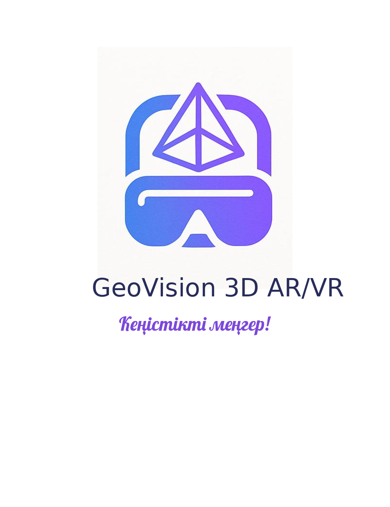

# GeoVision 3D AR/VR

  

**GeoVision 3D AR/VR** — бұл Мулдир Досымованың  авторлық жобасы.  
Жоба 3D геометриялық фигураларды визуалды түрде түсіндіруге арналған интерактивті веб-қосымша.

Оқушылар кеңейтілген шындық (AR) және виртуалды шындық (VR) арқылы фигуралардың көлемін, формуласын көріп, есептеп, тапсырма орындай алады.

---

## 🎯 Мақсаты

Орта және жоғары сынып оқушыларына (7–11) кеңістіктік ойлауды дамыту, геометрияны көрнекі түрде түсіндіру.

## 🛡 Авторлық құқық

> **Назар аударыңыз!**  
> Бұл платформа материалдары — Авторлық құқық © 2025 – Мулдир Досымова құқықпен қорғалған.  
> ✅ Ашық білім беру мақсатында пайдалануға рұқсат етіледі  
> ❌ Коммерциялық мақсатта пайдалануға тыйым салынады  
> 🔁 Көшіріп қолданғанда **автор есімі міндетті түрде көрсетілуі тиіс**

---

**© 2025. Платформаны жасаған:** *Muldir Dossymova*
